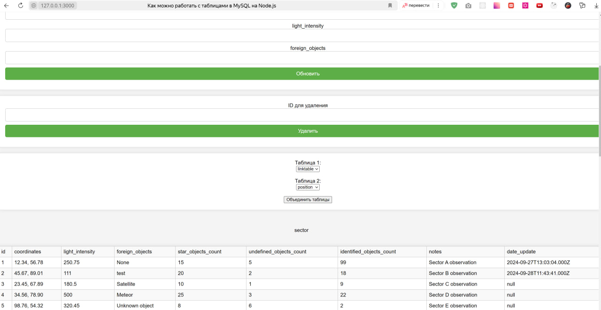
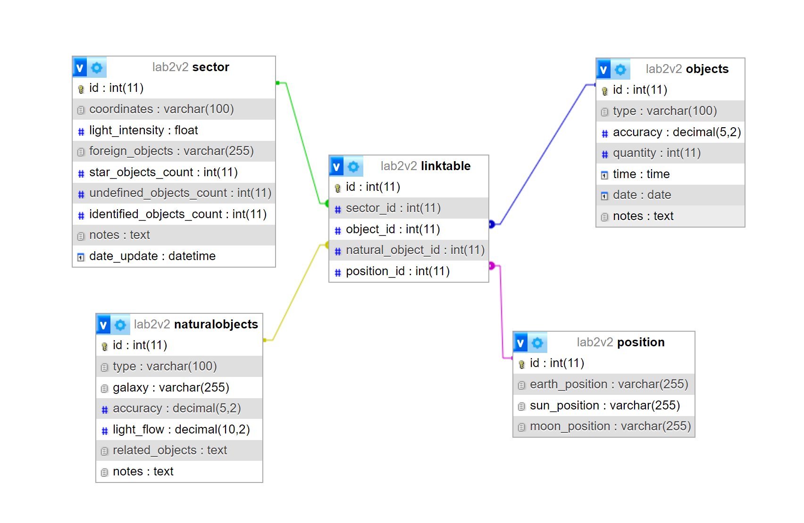

# practNode

Как можно работать с таблицами в MySQL на Node.js (JavaScript наоборот)

Внешний вид главного окна представлен далее.



бд в phpMyAdmin


Пример не требует Web-сервера. Достаточно установить Node.js, отредактировать пути в файле app.js, запустить файл run_server.bat, открыть страницу http://127.0.0.1:3000/

Перед запуском необходимо доустановить компонент с помощью команды: npm install sync-mysql. Дополнительный набор команд Chocolatey устанавливать необязательно.

запуск сервера:

```sh
npm run start
```

Пример гарантированно работает:

1. Версия Node.js v18.15.0, установленная из node-v18.15.0-x64.msi
2. Версия npm: 9.6.4
